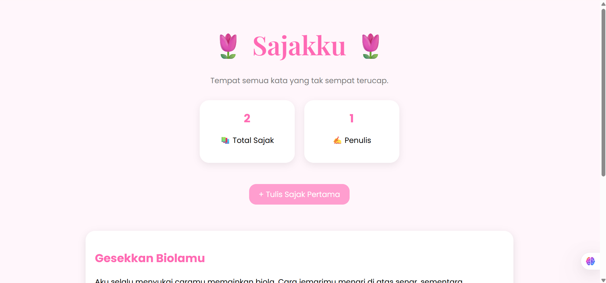
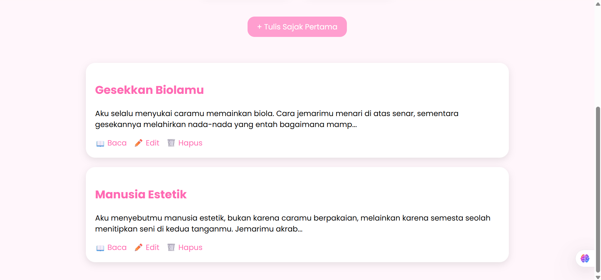
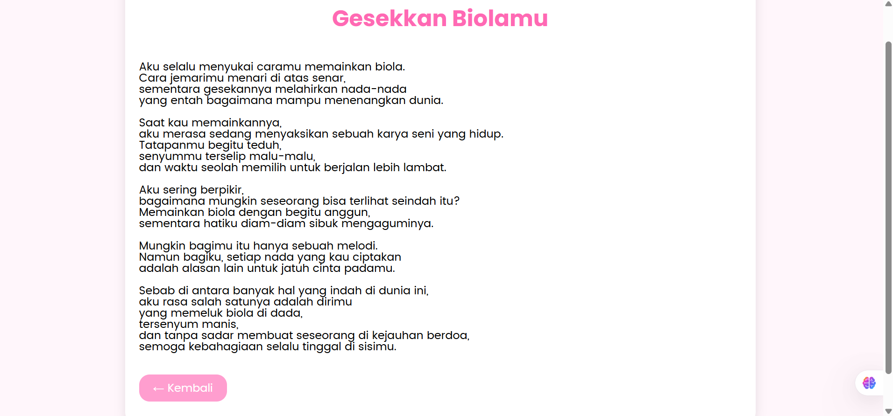
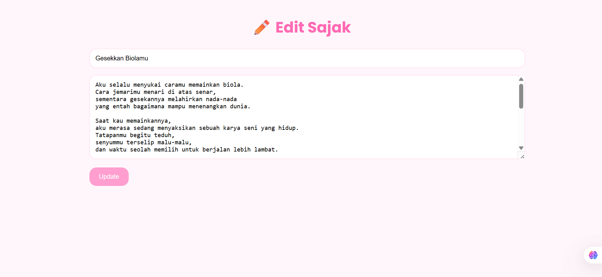
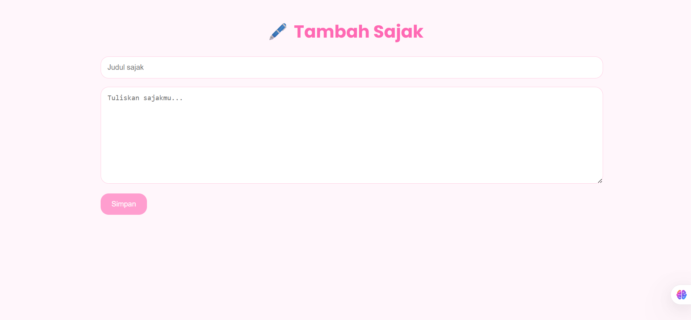

# 🌷 Sajakku

Tempat semua kata yang tak sempat terucap.

## ✨ Tentang Proyek

Sajakku adalah website sederhana untuk menulis, membaca, mengedit, dan mengelola sajak pribadi. Website ini dibuat menggunakan PHP dan MySQL dengan tampilan lembut bernuansa pink yang nyaman dibaca.

## 🚀 Fitur

- ✍️ Menulis sajak
- 📖 Membaca sajak
- 📝 Mengedit sajak
- 🗑️ Menghapus sajak
- 🔍 Pencarian sajak
- 🌙 Dark Mode
- 📱 Responsive Design

## 🖼️ Tampilan Website

### Halaman Utama

### Detail Sajak

### Edit Sajak

### Tambah Sajak

## 🛠️ Teknologi

- PHP
- MySQL
- HTML5
- CSS3
- JavaScript

## 💕 Inspirasi

Website ini dibuat sebagai ruang kecil untuk menyimpan perasaan, kenangan, dan kata-kata yang tak selalu bisa diucapkan secara langsung.
